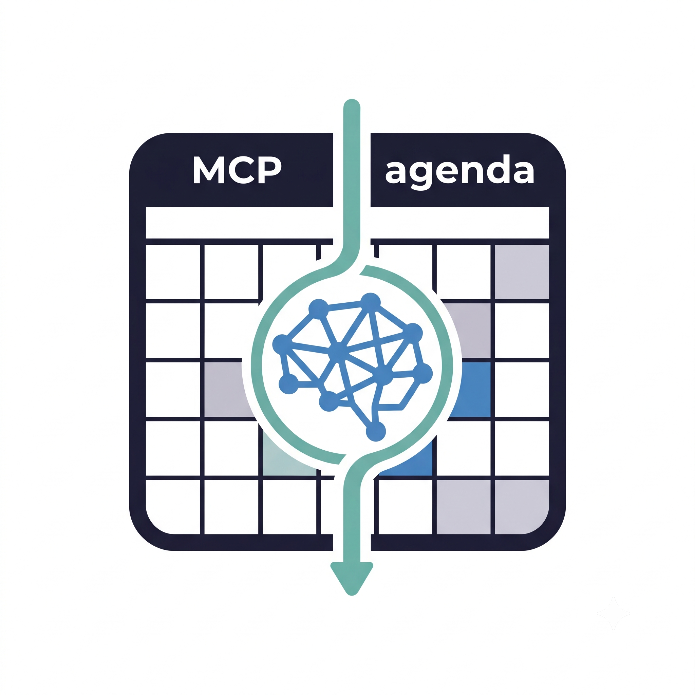

<p align="center">
  
</p>

<h1 align="center">mcp-agenda</h1>

<p align="center">
  <strong>MCP server for AI agent calendar management</strong><br>
  <em>Zero setup · SQLite-backed · Spanish NLP</em>
</p>

<p align="center">
  
  
  
</p>

---

## Install

```bash
npm install -g mcp-agenda
# or run directly:
npx -y mcp-agenda
```

## Quick Start

```bash
# 1. Initialize the database
npx -y mcp-agenda init

# 2. Start the MCP server
npx -y mcp-agenda
```

## Configuration

Add to your **MCP host** config (Claude Desktop, Cursor, Cline, OpenCode, etc.):

```json
{
  "mcpServers": {
    "mcp-agenda": {
      "command": "npx",
      "args": ["-y", "mcp-agenda"]
    }
  }
}
```

## Tools

| Tool | Description |
|---|---|
| `create_event` | Create event via NLP or structured fields |
| `list_events` | List events by date or range |
| `get_event` | Get event by ID |
| `update_event` | Update event fields |
| `delete_event` | Delete an event |
| `get_daily_summary` | Daily summary with counts |
| `parse_event_text` | Dry-run NLP parsing |
| `search_events` | Search title + description |
| `find_free_slots` | Available time slots |
| `check_conflicts` | Detect overlapping events |
| `get_agenda` | Human-readable agenda |

## Docs

Full documentation at [github.com/p5Patricio/mcp-agenda](https://github.com/p5Patricio/mcp-agenda)

## License

MIT
